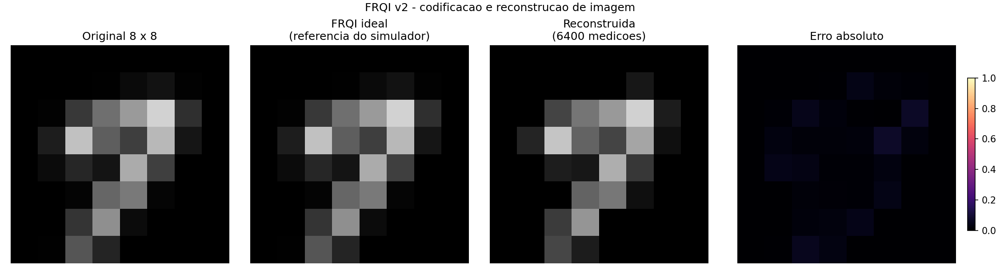

# FRQI: diferenças e correções entre a versão original e a v2

- **Data:** 5 de outubro de 2026
- **Versão original:** `frqi.py`
- **Versão corrigida:** `frqi_v2.py`
- **Objetivo:** transformar uma imagem clássica em um estado quântico FRQI e reconstruir a imagem a partir das medições.

A v2 mantém esse objetivo e corrige dois erros sistemáticos: a escala de intensidade e a ordem dos pixels. Também acrescenta uma referência ideal do simulador, tratamento de posições não medidas e recursos para repetir e analisar o experimento. A camada RZ/CNOT continua disponível no arquivo original; a v2 concentra a execução na reconstrução.

O arquivo original e seu README foram preservados. A v2 e este documento ficam na branch `codex/frqi-v2-reconstrucao`; a branch `main` continua com a versão original.

## 1. Comparação das versões

| Aspecto | Versão original | Versão v2 | Natureza da mudança |
| --- | --- | --- | --- |
| Rotação do qubit de cor | `mcry(theta, ...)` | `mcry(2 * theta, ...)` | Corrige a intensidade reconstruída |
| Índice do pixel nos qubits | Binário do bit mais significativo para o menos significativo | Bit menos significativo associado ao primeiro qubit de posição | Corrige a posição do pixel |
| Pixels com intensidade muito pequena | Pula a rotação quando `theta < 1e-6` | Pula apenas pixels exatamente iguais a zero | Evita descartar intensidades positivas |
| Posição sem medições | Fica com intensidade zero | Fica desconhecida (`NaN`) | Evita confundir falta de dados com preto |
| Referência ideal do circuito | Ausente | Calculada a partir do vetor de estado | Permite separar erro de implementação de erro dos shots |
| Camada RZ/CNOT | Integra o fluxo principal como cifra | Permanece apenas na versão original | Ajuste de escopo e interpretação |
| Entrada | MNIST, índice 15 definido no código | MNIST, arquivo de imagem ou demonstração sem download | Facilidade de uso |
| Tamanho e qubits | 8 x 8, sete qubits | Tamanho configurável; qubits calculados pelo número de pixels | Generalização do experimento |
| Execução | Shots fixos e sem semente explícita | Shots e sementes configuráveis; transpilação explícita | Reprodutibilidade |
| Dataset MNIST | Carregado pelo TensorFlow | Mesmo dataset oficial, lido diretamente do NPZ | Redução de dependências |
| Saídas | Imagem PNG e informações no terminal | PNG, matrizes NPZ, métricas JSON e tabela CSV | Registro dos resultados |
| Organização | Execução começa ao importar o arquivo | Funções reutilizáveis e entrada por `main()` | Facilita importação e validação |

## 2. Correção da intensidade: a rotação precisava do dobro do ângulo

Na representação FRQI usada no projeto, a intensidade normalizada de um pixel, `v`, determina:

```text
theta = v * pi/2
estado de cor = cos(theta)|0> + sin(theta)|1>
P(cor = 1 | posição do pixel) = sin(theta)^2
```

Entretanto, uma porta `RY(alpha)` usa **alpha/2** em suas amplitudes:

```text
RY(alpha)|0> = cos(alpha/2)|0> + sin(alpha/2)|1>
```

### Como estava

```python
theta = float(pixel) * (np.pi / 2)
qc.mcry(theta, qubits_pos, qubit_cor)
```

A probabilidade produzida era `sin(theta/2)^2`. A reconstrução usava `arcsin(sqrt(prob))` e dividia o resultado por `pi/2`, como se a probabilidade fosse `sin(theta)^2`.

Considerando probabilidades exatas e o pixel na posição correspondente, isso devolvia **metade da intensidade de entrada**:

| Intensidade de entrada | Reconstrução ideal pela fórmula da v1 | Reconstrução ideal na v2 |
| ---: | ---: | ---: |
| 0,00 | 0,00 | 0,00 |
| 0,50 | 0,25 | 0,50 |
| 1,00 | 0,50 | 1,00 |

### Como ficou

```python
theta = float(pixel) * np.pi / 2
qc.mcry(2 * theta, qubits_pos, 0, mode="noancilla")
```

Agora a porta produz as amplitudes esperadas e a fórmula de reconstrução recupera a intensidade correta. A correção está no ângulo aplicado ao circuito; a relação de reconstrução FRQI continua sendo `v = 2/pi * arcsin(sqrt(prob))`.

**Referências no código:** [v1: codificação e rotação](https://github.com/GuiOlialves/Imagens-FRQI/blob/ffe4c9b18d125abc6d1135c9d4a33a2cdcedf6de/frqi.py#L33), [v2: rotação corrigida](https://github.com/GuiOlialves/Imagens-FRQI/blob/9864090c94f76cf174a6c62a1d5d191cca3bebf1/frqi_v2.py#L57). A convenção do meio ângulo está na [documentação oficial da porta RY](https://quantum.cloud.ibm.com/docs/en/api/qiskit/qiskit.circuit.library.RYGate).

## 3. Correção da posição: codificação e leitura usavam ordens diferentes

O qubit `q[0]` guarda a cor. Os qubits `q[1]` a `q[6]` guardam a posição do pixel.

Na v1, `format(i, '06b')` produz os bits do índice do mais significativo para o menos significativo. O código atribuía esses bits, nessa ordem, a `q[1]`, `q[2]`, ..., `q[6]`.

O Qiskit apresenta a string de medição na ordem contrária: `q[6] ... q[1] q[0]`. Ao interpretar os seis primeiros bits como um inteiro, a reconstrução recebia o índice com os bits invertidos.

**Exemplo com um pixel de índice 1:**

| Etapa | v1 | v2 |
| --- | --- | --- |
| Índice original | `000001` = 1 | `000001` = 1 |
| Qubit de posição que recebe o bit 1 | `q[6]` | `q[1]` |
| Bits de posição na string medida | `100000` = 32 | `000001` = 1 |
| Local reconstruído em uma imagem 8 x 8 | Linha 4, coluna 0 | Linha 0, coluna 1 |

As linhas e colunas desse exemplo começam em zero. O efeito da v1 é uma reversão dos bits do endereço; não equivale necessariamente a uma simples rotação ou a um espelhamento da imagem.

Na v2, cada bit `j` do índice é associado ao qubit de posição `q[j+1]`:

```python
mascara = [q for j, q in enumerate(qubits_pos) if not (indice >> j) & 1]
```

A leitura separa cor e posição mantendo essa mesma convenção:

```python
valor = int(bits, 2)
posicao, cor = valor >> 1, valor & 1
```

**Referências:** [v1: máscara binária](https://github.com/GuiOlialves/Imagens-FRQI/blob/ffe4c9b18d125abc6d1135c9d4a33a2cdcedf6de/frqi.py#L36), [v2: associação dos bits](https://github.com/GuiOlialves/Imagens-FRQI/blob/9864090c94f76cf174a6c62a1d5d191cca3bebf1/frqi_v2.py#L61), [v2: leitura da medição](https://github.com/GuiOlialves/Imagens-FRQI/blob/9864090c94f76cf174a6c62a1d5d191cca3bebf1/frqi_v2.py#L108) e [ordem dos bits no Qiskit](https://quantum.cloud.ibm.com/docs/en/guides/bit-ordering).

## 4. Outras correções na reconstrução

### Posição não medida não é um pixel preto

A v1 inicia a matriz reconstruída com zeros. Quando uma posição não aparece nas medições, ela continua com valor zero, como se seu pixel tivesse sido medido e fosse preto.

A v2 retorna `NaN` para posições sem amostras. Elas aparecem em magenta no painel e ficam sem valor de intensidade no CSV. O programa também registra a cobertura: a proporção de posições que receberam alguma medição.

Se a cobertura for incompleta, MSE e PSNR globais ficam indefinidos. Isso evita avaliar uma imagem parcialmente desconhecida como se todos os pixels tivessem sido recuperados. Em um teste 2 x 2 com apenas um shot, a cobertura foi de 25%, conforme esperado.

### Intensidades pequenas continuam sendo codificadas

A v1 ignora pixels cujo ângulo é menor que `1e-6`. A v2 só ignora pixels exatamente pretos. A mudança evita uma aproximação adicional que não era explicitada nas métricas da versão original.

## 5. Ajuste do papel da camada RZ/CNOT

A v1 possui três caminhos: estado FRQI sem cifra, estado após RZ/CNOT e estado após a transformação seguida de sua inversa. A operação de aplicar um circuito unitário e depois seu inverso está correta: `U^-1 * U` restaura o estado de entrada, no caso ideal.

Há, porém, uma diferença entre restaurar o **estado quântico completo** e reconstruir as **intensidades medidas**. No bloco usado pela v1:

- RZ altera fases dos estados de base, preservando o módulo de cada amplitude.
- A cadeia de CNOT permuta os estados de posição de forma fixa e reversível.
- A segunda camada de RZ altera novamente as fases.
- A medição final é feita na base computacional, sem uma operação posterior que converta essas fases em mudanças de probabilidade.

Assim, cada amplitude é levada a outra posição e multiplicada por uma fase. Sua probabilidade, que depende do módulo ao quadrado, permanece a mesma. Essa conclusão vale também quando o estado contém superposição e correlações entre cor e posição.

**Consequência para a imagem observada:** a cadeia de CNOT reorganiza as posições dos pixels, mas os valores da chave RZ não alteram suas intensidades medidas nesse circuito ideal. Desfazer a permutação recupera a distribuição usada na reconstrução, mesmo que as fases do estado completo não tenham sido restauradas.

Na conferência numérica feita com duas chaves RZ diferentes, a maior diferença entre as probabilidades finais foi aproximadamente `1,73 x 10^-17`, compatível com arredondamento numérico.

A v2 concentra seu fluxo na codificação e reconstrução, conforme o objetivo declarado do projeto. O bloco RZ/CNOT foi mantido no arquivo original para preservar o histórico. O ciclo reversível continua sendo uma demonstração válida de reversibilidade; ele, sozinho, não estabelece segurança criptográfica nem corrige os erros de codificação e leitura.

**Referências:** [bloco original RZ/CNOT](https://github.com/GuiOlialves/Imagens-FRQI/blob/ffe4c9b18d125abc6d1135c9d4a33a2cdcedf6de/frqi.py#L49), [matriz da porta RZ](https://quantum.cloud.ibm.com/docs/en/api/qiskit/qiskit.circuit.library.RZGate) e [ação da porta CX/CNOT](https://quantum.cloud.ibm.com/docs/en/api/qiskit/qiskit.circuit.library.CXGate).

## 6. Resultados da validação

Foi usado o **MNIST de índice 15, dígito 7**, normalizado e redimensionado de 28 x 28 para 8 x 8 com o mesmo procedimento do código original. São 64 pixels e sete qubits.

| Reconstrução comparada à imagem 8 x 8 | MSE | PSNR | Maior erro absoluto em um pixel |
| --- | ---: | ---: | ---: |
| v1, probabilidades exatas do circuito sem cifra | 0,0644897044 | 11,91 dB | 0,813210 |
| v2, referência ideal do simulador | 3,04 x 10^-30 | 295,17 dB | 4,11 x 10^-15 |
| v2, 6.400 shots, seed 42 | 0,0005090338 | 32,93 dB | 0,074918 |

**Como interpretar:** MSE menor significa menor erro médio quadrático; PSNR maior significa menor erro relativo à escala de intensidade. O resultado ideal da v2 ficou na precisão numérica do simulador. Seu PSNR muito alto não representa uma medição física com essa precisão.

A linha da v1 foi calculada usando seu próprio codificador e sua própria função de reconstrução, alimentada com probabilidades exatas do circuito. Portanto, seu erro já existia sem a incerteza das medições. Não foi uma execução completa do script original nem uma medição da cifra. As duas linhas ideais permitem comparar os erros sistemáticos de implementação; a linha com shots mostra a incerteza de amostragem da v2.

Na execução com 6.400 shots, todos os pixels foram observados. Cada posição recebeu entre **79 e 126 amostras**. Mais shots tendem a reduzir o erro estatístico, mas uma rodada individual não garante melhora monotônica.



*Da esquerda para a direita: imagem de referência 8 x 8, reconstrução ideal calculada do estado quântico, reconstrução com 6.400 medições e mapa de erro absoluto. As três imagens usam a mesma escala de intensidade, de 0 a 1.*

### Verificações realizadas

Os oito testes em [tests/test_frqi_v2.py](tests/test_frqi_v2.py) passaram:

1. Amplitudes do estado confrontadas com a equação FRQI para uma grade assimétrica de 64 intensidades.
2. Reconstrução ideal preservando cada intensidade e posição.
3. Caso de um único pixel, com preto, branco e tons intermediários.
4. Leitura das medições reais do Aer com marcadores pretos e brancos em posições assimétricas.
5. Estimação dos tons de cinza sem o erro sistemático de meia intensidade.
6. Tratamento correto de pixels não observados.
7. Separação correta entre o bit de cor e os bits de posição.
8. Rejeição de imagens, contagens e parâmetros inválidos.

Também foram executados os caminhos de entrada MNIST, demonstração e arquivo de imagem, além de uma execução com cobertura incompleta.

As dependências principais usadas foram Qiskit 2.2.3, Qiskit Aer 0.17.2, NumPy 2.2.6 e scikit-image 0.25.2. O arquivo [requirements_v2.txt](requirements_v2.txt) registra as versões fixadas.

## 7. Arquivos novos e como repetir o experimento

| Arquivo | Finalidade |
| --- | --- |
| `frqi_v2.py` | Código corrigido e execução configurável |
| `README_v2.md` | Instruções de instalação e uso |
| `requirements_v2.txt` | Dependências da nova versão |
| `tests/test_frqi_v2.py` | Verificações dos erros corrigidos e da reconstrução |
| `DIFERENCAS_E_CORRECOES_FRQI.md` | Este documento de comparação |

No diretório do projeto, em Windows:

```powershell
python -m venv .venv
.venv\Scripts\python -m pip install -r requirements_v2.txt
.venv\Scripts\python -m unittest discover -s tests -v
.venv\Scripts\python frqi_v2.py --mnist-indice 15 --shots 6400 --seed 42 --saida resultados_mnist_v2 --sem-janela
```

O MNIST é baixado na primeira execução e reutilizado depois. Para testar sem download:

```powershell
.venv\Scripts\python frqi_v2.py --demo --sem-janela
```

Em macOS/Linux, substitua `.venv\Scripts\python` por `.venv/bin/python`.

A pasta de saída contém as matrizes em NPZ, as contagens e métricas em JSON, a comparação pixel a pixel em CSV e o painel PNG. Para preservar diferentes rodadas, escolha uma pasta `--saida` diferente para cada execução.

## 8. Limites do que foi demonstrado

A imagem reconstruída corresponde à referência **depois** da conversão para cinza e do redimensionamento. A redução de 28 x 28 para 8 x 8 perde detalhes; o experimento não recupera os 28 x 28 originais.

A reconstrução ideal vem das probabilidades do estado produzido pelo circuito. Ela não copia a imagem de entrada, mas utiliza um acesso completo ao vetor de estado que existe no simulador e não está disponível em hardware quântico. A reconstrução por shots é a estimativa obtida das medições.

As execuções foram feitas em um simulador ideal, sem modelo de ruído de hardware. Os resultados validam a codificação, a ordem dos pixels e a reconstrução nesta implementação. Não constituem uma demonstração de vantagem de velocidade sobre processamento clássico nem de segurança criptográfica.

**Fontes de código preservadas para esta comparação:** [v1 no commit ffe4c9b](https://github.com/GuiOlialves/Imagens-FRQI/tree/ffe4c9b18d125abc6d1135c9d4a33a2cdcedf6de) e [v2 no commit 9864090](https://github.com/GuiOlialves/Imagens-FRQI/tree/9864090c94f76cf174a6c62a1d5d191cca3bebf1).
